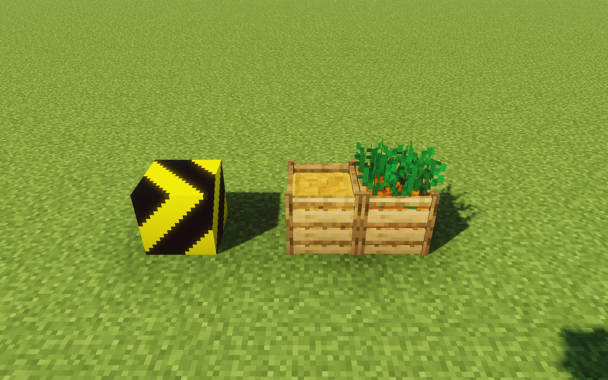

# NadBlocks (Nova 0.17)

Some cool blocks that don't do anything (at least for now)

Development has been moving a bit slowly lately,  
but that doesn’t mean NadBlocks is abandoned! Me and the other dev just haven't had much time recently.

> [!CAUTION]
> Important: **This is NOT a plugin**, but a Nova addon.  
> [Nova Installation Guide](https://xenondevs.xyz/docs/nova/admin/setup/).

## Blocks

- Hazard Block
- *Vegetable/Fruit Crates*
    - Carrot Crate
    - Potato Crate
    - Apple Crate
- Table - TODO: Improve model
- Drain Grate
- Lamp

# Supported languages

- English
- Polish
